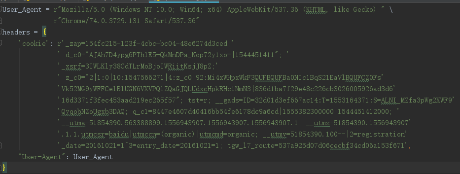
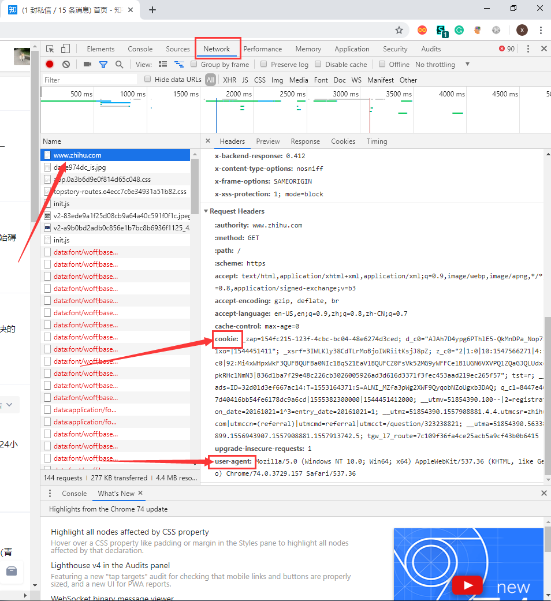
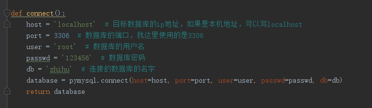
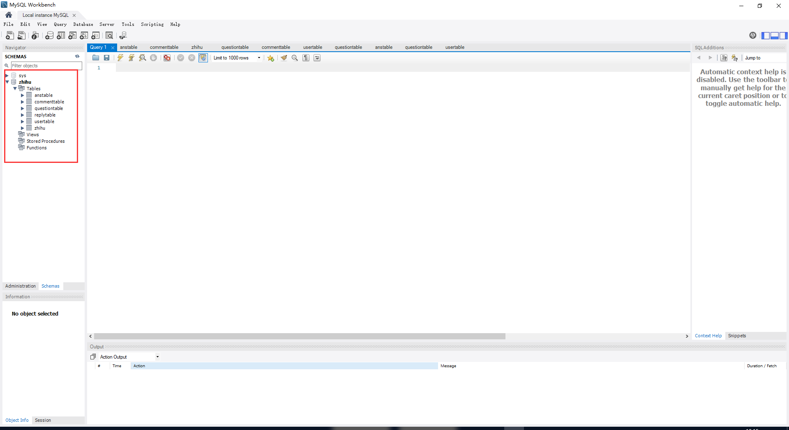
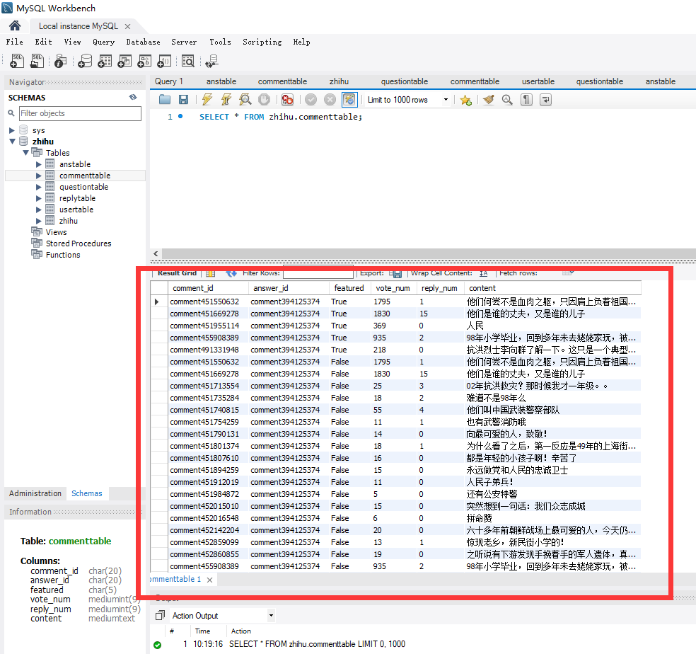
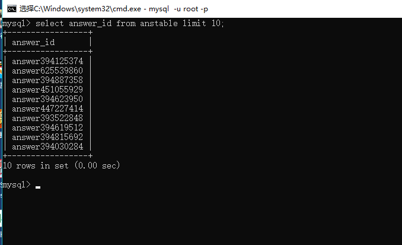

# 知乎爬虫
## 简介  
可以根据关键字，爬取关键字话题下的问题及其回答和评论
## 环境及依赖
python 3.6.5及以上  
MySQL 8.0版本及以上  
PyMySQL  0.9.3  
requests  2.18.4  
lxml  4.2.1

## 使用步骤  
### 1、首先要安装MySQL数据库  
[MySQL安装教程](https://www.runoob.com/mysql/mysql-install.html)  
### 2、然后安装依赖包
因为已经生成了**requirements.txt**，只需要在项目的目录下，命令行下输入下面的代码:  

>pip install -r requirements.txt

**PS：**是在项目的目录下输入这句代码 
### 3、创建数据库  
按照第一步的教程安装好数据库后，创建一个数据库，数据库的名称可以自己定  
### 4、修改文件SpiderConfig.py  
SpiderConfig.py中有两个变量，一个是**User_Agent**，一个是**headers**
  

**User_Agent**的作用是把爬虫伪装成是浏览器在访问，**headers**则是发起请求的请求头，其中的cookie是把爬虫伪装成登录状态，这两个关键字需要通过抓包的方式获取。最简单的方式是使用谷歌浏览器: 
 
+ 打开知乎的页面  
+ 登录  
+ 然后按f12，选择network一项  
+ 按f5刷新
+ 如下图所示：  

  

将cookie及user-agent复制到代码中替换掉即可  
**注意：**python代码一行不能够太长，将cookie复制到代码中后，可能长度会超出限制，如果您是使用的pycharm等类似的集成环境编写代码，只需要在过长的代码处按回车即可，pycharm会自动在你的代码当中添加换行符。如果是使用的普通的文本编辑器，你需要按照如下的方式编写哒嘛换行：
>test = 'Hello,World'  
>test = 'Hello,' \ # 在换行的结尾处加上符号'\'  
>&nbsp;&nbsp;&nbsp;&nbsp;&nbsp;&nbsp;&nbsp;&nbsp;&nbsp;&nbsp;&nbsp;'World' 

### 5、修改ZhihuSQL.py  
**ZhihuSQL.py**内存有建立的表的结构形式，还有一个函数叫**connect()**,它的功能是连接目标数据库：
  
  

按照注释将对应的变量修改为自己的数据库的信息即可  

### 6、打开Spider.py运行  
在**Spider.py**第10行有个变量名叫keywords，那就是需要爬取的关键字,改成自己需要的关键字即可运行  
运行方式：  
* pycharm直接右键运行即可   
* 命令行定位到程序所在文件夹,输入:  
>python Spider.py  

运行即可  
## 代码结构  

- **Spider.py**&nbsp;&nbsp;程序的主文件,程序开始的地方  
- **ManySpiders.py**&nbsp;&nbsp; 爬取知乎各个页面的爬虫  
   hastopic() &nbsp;&nbsp;&nbsp;判断该关键词搜索出来是否有话题，并且返回话题的url及名字  
   TopicSpider()&nbsp;&nbsp;&nbsp;爬取话题页面下的问题，并提取出问题的url给下一个函数  
   AnswerSpider()&nbsp;&nbsp;&nbsp; 爬取一个问题下所有的答案与其相关的信息  
   voterSpider()&nbsp;&nbsp; 爬取一个答案的点赞信息  
   commentSpider()&nbsp;&nbsp; 爬取一个答案下的所有评论  
   childCommenSpider()&nbsp;&nbsp; 爬取评论的所有回复信息
- **SpiderConfig**&nbsp;&nbsp; 存放着爬虫的一些参数信息，一般情况下除了**User_Agent**和**headers**，其它的不用修改  
- **ZhihuSQL.py**&nbsp;&nbsp; &nbsp;&nbsp;存放着连接到数据库的函数以及建库的SQL语句，一般只需要修改连接函数  
## 运行结果查看
### 1.可以使用数据库可视化工具，如MySQL官方开发的[MySQL Workbench](https://dev.mysql.com/downloads/workbench/)，打开软件后，连接到数据库，连接成功后界面如下图：  

左边框起来的一列就是你的数据库,选择你想查看的数据库下的表,右键选择**Select Rows limit 1000**，结果就显示出来了，如下图：   

  
### 2.在命令行输入命令查看结果
首先连接至数据库，使用use命令选择需要使用的数据库：  
>use 数据库名  

然后使用查询语句select查询需要的数据，如：  
>select * from anstable  

这句话的意思是查询anstable下的所有字段的数据,星号可以改成表中你需要的字段，如**answer_id**：  
>select answer_id from anstable  

查询结果如下图：  

  

命令结尾limit 10的意思是只显示10条输出
